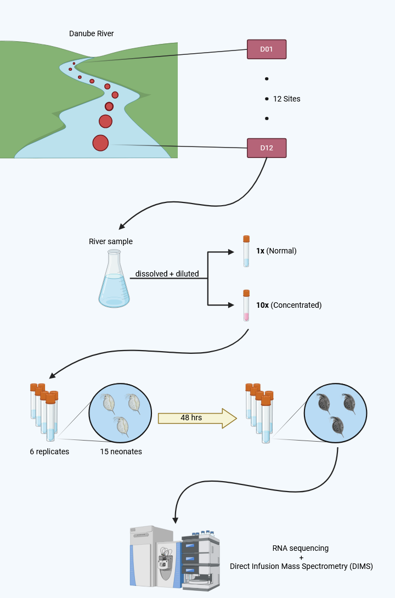
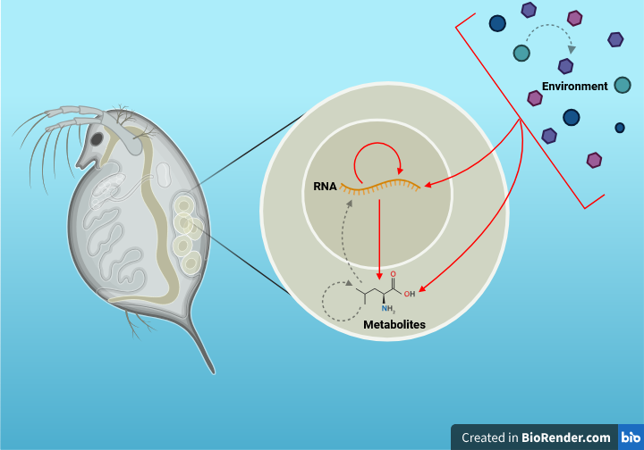

# Analysing transcriptome and metabolome responses to different Danube locations in Daphnia

## Data Overview
<p align="center">
  
</p>

## Interactions Model
<p align="center">
  
</p>

## Scientific Questions
1. How does the individual omics level change over different locations (D01-D12),
concentration levels (Control, 1x, 10x), and their interactions?

2. How do the interactions between the multiple omics levels change over different
locations, concentration levels, and their interactions?

3. How does the change relate to the distribution of detected individual organic
chemical compounds? Which chemical may cause the most significant adverse?
outcome on the Daphnia?

4. What biological/environmental insights can you obtain from your data analysis
findings?


## Contributors

- Takahiro Kato

- Lauren Alexander

- Yunchen Qi

- Miguel Alburo 

## File Descriptions

```bash
datajamboree/
│
├── data/
│   │ # Peak intensity matrices
│   │ #     - Positive & negative ion modes
│   │ #     - Raw & glog transformed
│   ├── polar_neg_pqn_imputed.csv               
│   ├── polar_neg_pqn_imputed_glog.csv
│   ├── polar_pos_pqn_imputed.csv
│   ├── polar_pos_pqn_imputed_glog.csv
│   │ # Gene counts matrices
│   ├── rna_raw_counts.csv  # Raw
│   ├── rna_norm_counts.csv # Normalised
│   ├── rna_vst_counts.csv  # Variance-stabilising
│   │ # Conditions metadata
│   ├── water_chemicals.tsv # Chemical levels
│   ├── chem_conc.csv       # Sample x Concentration transformation
│   ├── chem_conc_noise.csv # Noise imputed
│   └── sample_sheet.csv    # Sample sheet (1x/10x)
│
├── annotations/
│   │ # Peak-to-metabolite
│   ├── polar_neg_pkl_to_kegg_annotations.tsv
│   ├── polar_pos_pkl_to_kegg_annotations.tsv
│   │ # Daphnia-to-ortholog gene mapping
│   ├── rna_dma_to_hsa_mappings.tsv     # Human Ensembl
│   ├── rna_dma_to_hsa_gn_mappings.tsv  # Human Gene Name
│   └── rna_dma_to_dme_mappings.tsv     # Drosophila
│
├── scripts/
│   ├── functions.R         # Essential. Load first.
│   ├── annotations.R       # Annotation functions
│   ├── process_chemicals.R # Chemical Impute
│   ├── cytoscape.R         # WGCNA visualisations
│   ├── wgcna.R             # Weighted Gene Co-expression Network
│   ├── wmcna.R             # Metabolite Co-abundance Network
│   ├── pca.R               # Principal Component Analysis
│   ├── rgcca.R             # Canonical Correlation Analysis
│   └── eigen.R             # WGCNA x WMCNA relationships
│
└── README.md
```